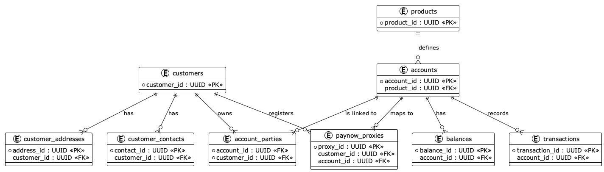
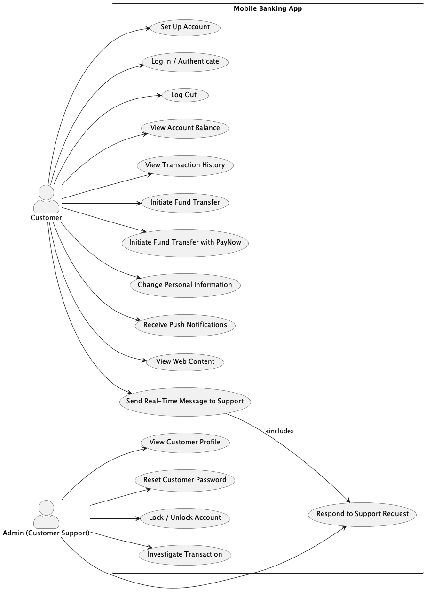
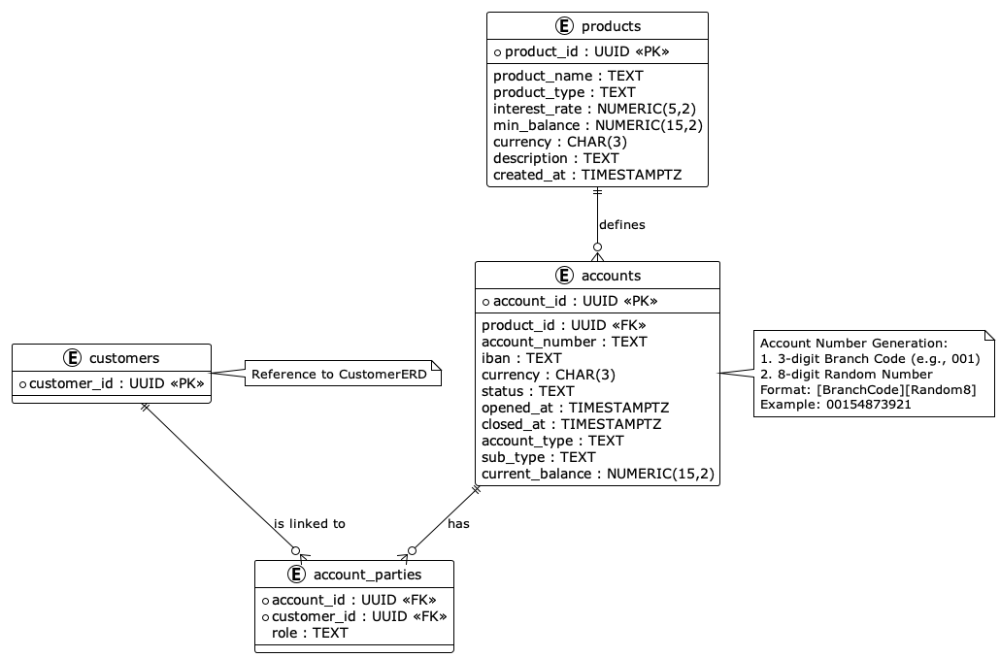
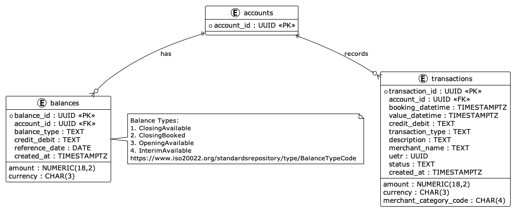

# Mobile Banking Application - Database Schema & Architecture

## Overview

This project contains a comprehensive database schema and architecture design for a mobile banking application. The design tries to follows banking industry standards and incorporates best practices for financial data management.

---

## 🏗️ Architecture Components

### Database Schema Files

1. **`Bankk_Database_Schema_PostgreSQL.sql`** - Complete PostgreSQL database schema implementation
2. **`OverviewOfSchema.puml`** - High-level entity relationship overview
3. **`BankDatabase_CustomerERD.puml`** - Customer management entities and relationships
4. **`BankDatabase_AccountsERD.puml`** - Account and product management entities
5. **`BankDatabase_BalAndTrans.puml`** - Balance and transaction management entities
6. **`MobileBankingAppUseCase.puml`** - Use case diagram showing application functionality

---

## 📊 Visual Schema Overview

### Complete Database Schema

*Complete entity relationship diagram showing all tables and their relationships*

### Mobile Banking Use Cases

*Comprehensive use case diagram for customer and administrative functions*

---

## 📊 Database Schema Design

### Core Entities

#### Customer Management
- **`customers`** - Core customer information with KYC compliance
- **`customer_contacts`** - Multiple contact methods (email, phone, mobile)
- **`customer_addresses`** - Historical address tracking for compliance


*Customer management entities with sample data and relationships*

#### Product & Account Management
- **`products`** - Banking products (Savings, Current, Fixed Deposit, Loan, Credit Card)
- **`accounts`** - Customer accounts with proper account number generation
- **`account_parties`** - Multi-party account relationships (Primary Owner, Joint Owner, Authorized User)


*Account and product management with account number generation logic*

#### Transaction & Balance Management
- **`transactions`** - Complete transaction records with ISO 20022 compliance
- **`balances`** - Multiple balance types following ISO standards
- **`paynow_proxies`** - Singapore PayNow integration for mobile payments


*Transaction and balance management with ISO compliance standards*

---

### Key Considerations

#### 🔐 Security & Compliance
- UUID primary keys for security
- KYC (Know Your Customer) compliant customer data structure
- Historical tracking for addresses and contacts

#### 💱 Multi-Currency Support
- ISO 4217 currency codes throughout the schema
- Support for international transactions
- IBAN support for international accounts

#### 🏦 Banking Standards Compliance
- ISO 20022 balance type codes
- ISO 18245 Merchant Category Codes (MCC)
- Proper debit/credit accounting principles
- Standard account number generation (Branch Code + Account Number)

#### 🇸🇬 Singapore-Specific Features
- PayNow proxy integration (Mobile, NRIC, UEN)
- Singapore residency and ID number support
- Local compliance considerations

---

## 🎯 Use Cases Supported

The mobile banking application supports the following use cases:

### Customer Functions
- ✅ Account setup and management
- ✅ User authentication and session management
- ✅ Real-time balance viewing
- ✅ Transaction history access
- ✅ Fund transfers (traditional and PayNow)
- ✅ Personal information management
- ✅ Push notifications
- ✅ Customer support messaging

### Administrative Functions
- ✅ Customer profile management
- ✅ Account security controls (lock/unlock)
- ✅ Password reset capabilities
- ✅ Transaction investigation tools
- ✅ Customer support response system

---

## 🗃️ Database Schema Highlights

### Account Number Generation
```
Format: [3-digit Branch Code]-[8-digit Random Number]
Example: 001-12345678
```

### Balance Types (ISO 20022 Compliant)
- **ClosingAvailable** - Available balance at end of day
- **ClosingBooked** - Booked balance at end of day
- **OpeningAvailable** - Available balance at start of day
- **InterimAvailable** - Real-time available balance

### Transaction Status Flow
```
Pending → Booked/Rejected
```

### Customer Types
- Regular customers
- Premium customers
- SME (Small & Medium Enterprise) customers

---

## 🚀 Getting Started

### Prerequisites
- PostgreSQL 12+ database server
- PlantUML for viewing diagrams

### Database Setup
1. Create a new PostgreSQL database
2. Execute the `Bankk_Database_Schema_PostgreSQL.sql` script
3. Verify all tables and constraints are created successfully

### Viewing Diagrams
1. Install PlantUML or use an online PlantUML viewer
2. Open any `.puml` file to view the corresponding diagram
3. Use `OverviewOfSchema.puml` for a complete relationship overview

---

## 📋 File Descriptions

| File | Purpose |
|------|---------|
| `Bankk_Database_Schema_PostgreSQL.sql` | Complete database schema with all tables, constraints, and relationships |
| `OverviewOfSchema.puml` | High-level ERD showing all entities and their relationships |
| `BankDatabase_CustomerERD.puml` | Detailed customer management schema with sample data |
| `BankDatabase_AccountsERD.puml` | Account and product management with account number generation logic |
| `BankDatabase_BalAndTrans.puml` | Transaction and balance management with ISO compliance notes |
| `MobileBankingAppUseCase.puml` | Complete use case diagram for the mobile banking application |

---

## 🏅 Best Practices Implemented

### Data Modeling
- Normalized database design (3NF)
- Proper foreign key relationships
- Appropriate data types and constraints

---

## Author

This schema serves as a foundation for a mobile banking application and can be extended based on specific business requirements and regulatory needs.
Don't quote me on anything ~ Nic Tok